<div align="center">



<code>landing page · crafted-glitches.github.io</code>

</div>

---

this repo **is** the site — one static page, no build, no dependencies.
the centrepiece is a black hole rendered live in a WebGL shader.

```
index.html       the page
404.html         signal-lost page
css/style.css    dark system · overlays · glitch keyframes
js/vortex.js     webgl vortex — falls back to the logo
js/glitch.js     boot · text decode · cursor · telemetry
assets/          logo + banner
```

<sub>open `index.html` — no server required · rests quietly on `prefers-reduced-motion`</sub>

<div align="center">
<br>
<sub>[ live ](https://crafted-glitches.github.io)&nbsp;&nbsp;·&nbsp;&nbsp;[ org ](https://github.com/crafted-glitches)</sub>

</div>
